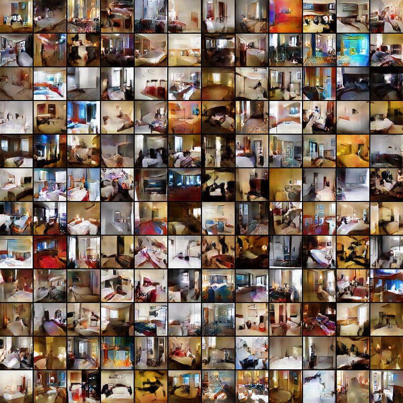

# Cooperative Learning of Energy-Based Model and Latent Variable Model via MCMC Teaching
This repository is a pytorch implementation for the paper <a href="http://www.stat.ucla.edu/~jxie/CoopNets/CoopNets.html">
Cooperative Learning of Energy-Based Model and Latent Variable Model via MCMC Teaching</a>

Checkout the original tensorflow implementation <a href="https://github.com/zilongzheng/CoopNets">here</a>

## Requirements	
- Python3
- [Pytorch](https://pytorch.org/) >=0.4.0
- Opencv
- numpy

## Installation
Clone the repository

    $ git clone https://github.com/FANG-Xiaolin/pytorch-CoopNets.git

You can simply install the requirements via `pip`. (A virtualenv is recommended)

    $ pip install opencv-python
    $ pip install torch==0.4.0 torchvision
    $ pip install numpy

## Training
1. Download the dataset

Run the following command at the root directory of the project.

    $ python download.py scene
    

    
The Imagenet-scene dataset will be downloaded and saved to `./data` directory. (approximately 3.8G)

2. Train a model by
    
 
    $ python main.py
    
E.g.
Train the model on ***alp*** dataset  by

    $ python main.py -category alp -num_epoch 300 -lr_des 0.01 --lr_gen 0.0001
    
By default, the result will be save to `./result_images`, the checkpoints and 
log will be saved into 
`./checkpoint`

Details about the flags can be seen by 

    $ python main.py -h
    
    
## Result
Below is the result_image after training on `alp`(about 2000 images) within hundreds of epochs.

Result on `desert-sand`(about 5000 images) and `hotel-room`(about 5000 images) subset of MIT-Place Dataset

## Reference
    @inproceedings{coopnets,
        author = {Xie, Jianwen and Lu, Yang and Gao, Ruiqi and Wu, Ying Nian},
        title = {Cooperative Learning of Energy-Based Model and Latent Variable Model via MCMC Teaching},
        booktitle = {The 32nd AAAI Conference on Artitifical Intelligence},
        year = {2018}
    }
    
    

## Acknowledgement
Thanks to <a href="https://github.com/jianwen-xie">@Jianwen-Xie</a> and 
<a href="https://github.com/zilongzheng">@Zilong-Zheng</a> for their
 <a href="github.com/zilongzheng/CoopNets">tensorflow implementation</a>

